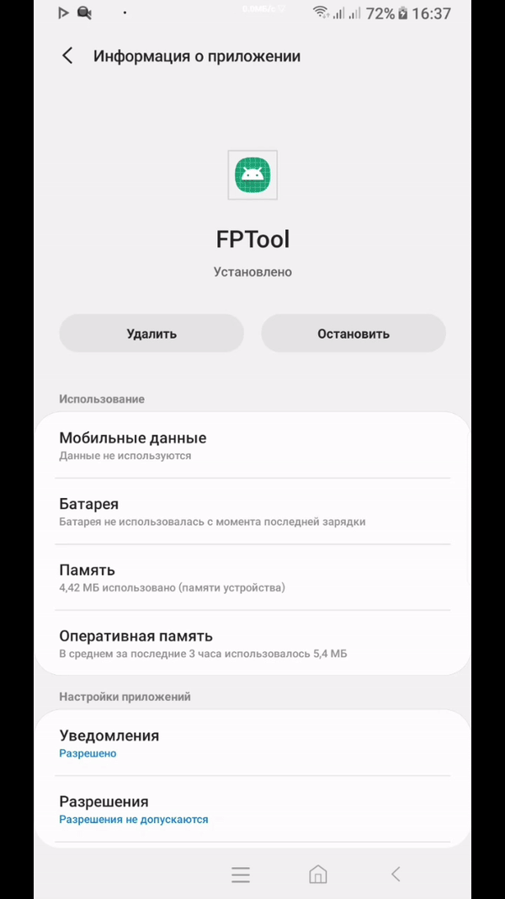

# FakePermission
Android Fake Permission Tool

Библиотека предоставляет возможность перекрывать системный диалог выдачи разрешений начиная с Android 6.0. Таким образом вы сможете незаметно для конечного пользователя выдавать вашему приложению нужные разрешения, вводя пользователя в заблуждение, заставляя его соглашаться с тем что он увидит, а не с тем, что будет в действительности.

**Все предоставляется как есть, и не призывает никого к использованию**

## Демонстрация работы библиотеки


## Подключение

Добавьте зависимость в build.gradle проекта
```
repositories {
    maven { url "https://dl.bintray.com/vittach/FakePermission" }
    ...
}
```
А также добавть в build.gradle модуля вашего приложения
```
implementation 'com.vittach:fakepermission:1.0.0@aar'
```
## Настройка и пример использования

Для активации библиотеки необходимо запустить ее активити *PermissionActivity* и передать нужные конфигурационные параметры сразу строго ПОСЛЕ вызова системного диалога на выдачу пермишенов.

Если вы используете сторонние библиотеки для вызова системного диалога, как например такую на базе корутин:
```
com.sagar:coroutinespermission:1.0.0
```
То убедитесь, что корутина, в которой она будет вызываться имеет немедленный диспетчер: Dispatchers.Main.immediate.

Порядок появления диалогов очень важен, поскольку FakePermission по своей сути просто перекрывает системный диалог.
```
startActivity(
    Intent(this, PermissionActivity::class.java)
        .apply {
            putExtra(PORTRAIT_BOTTOM_MARGINS, portraitBottomMargins)
            putExtra(PORTRAIT_SIDE_MARGINS, portraitSideMargins)
            putExtra(LAND_BOTTOM_MARGINS, landBottomMargins)
            putExtra(LAND_SIDE_MARGINS, landSideMargins)
            putExtra(ORIGIN_PERMISSIONS, originPermissions)
            putExtra(FAKE_PERMISSIONS, fakePermissions)
            putExtra(FAKE_ICONS, fakeIcons)
        }
)
```
#### Обязательные конфигурационные параметры:
* **originPermissions**
    ```
    val originPermissions = arrayOf(
        Manifest.permission.ACCESS_FINE_LOCATION,
        Manifest.permission.BODY_SENSORS,
        ...
    )
    ```
* **fakePermissions**

    Массив строк, текст которых будет отображаться поверх реального. Размерность массива должна совпадать с массивом *originPermissions*.
    Если кастомный текст по длине будет больше чем исходный, то перекрываемая область увеличится

    ```
    val fakePermissions: Array<String> = arrayOf(
        getString(R.string.permission_fine_location_fake),
        getString(R.string.permission_body_sensors_fake),
        ...
    )
    ```
#### Необязательные конфигурационные параметры:
Вы можете настраивать отступы снизу и по бокам для каждого из выдаваемых пермишенов по порядку их запроса так, чтобы добиться полного перекрытия исходного текста. Поддерживается настройка как для портретной так и ландшафтной ориентации.
* **portraitBottomMargins**
    ```
    val portraitBottomMargins: Array<Int> = arrayOf(
        100f.pxFromDp(this),
        65f.pxFromDp(this),
        ...
    }
    ```
* **portraitSideMargins**
* **landBottomMargins**
* **landSideMargins**

Вы также можете установить свои иконки для каждого из запрашиваемых разрешений. При этом размерность массива может не совпадать с массивом *originPermissions*, в таком случае в качестве иконки, когда очередь до нее дойдет, будет использоваться последняя.
* **fakeIcons**
    ```
    val fakeIcons: Array<Int> = arrayOf(
        R.drawable.ic_location,
        R.drawable.ic_anchor,
        ...
    )
    ```
